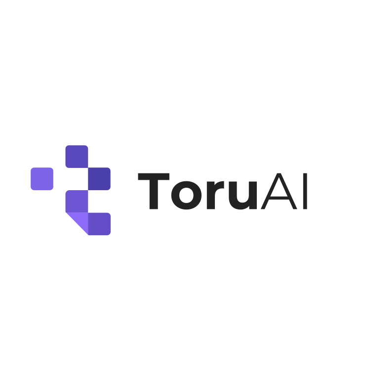
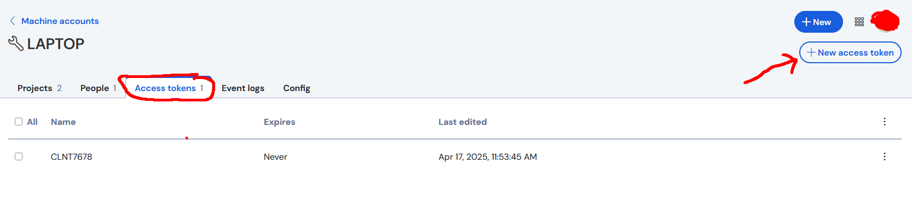

# ToruVault

A simple Python package for managing Bitwarden secrets with enhanced security.


## Features

- Load secrets from Bitwarden Secret Manager into environment variables
- Get secrets as a Python dictionary
- Filter secrets by project ID
- Secure in-memory caching with encryption
- Automatic cache expiration (5 minutes)
- Secure file permissions for state storage
- Machine-specific secret protection
- Secure credential storage using OS keyring

## Installation

### Using UV (Recommended)

```bash
# Install UV if you don't have it already
curl -LsSf https://astral.sh/uv/install.sh | sh

# Install vault package
uv pip install vault

# Or install in a virtual environment (recommended)
uv venv create -p python3.10 .venv
source .venv/bin/activate  # On Windows: .venv\Scripts\activate
uv pip install vault
```


This will automatically install all required dependencies:
- bitwarden-sdk - For interfacing with Bitwarden API
- keyring - For secure credential storage
- cryptography - For encryption/decryption operations

### From Source with UV

```bash
# Clone the repository
git clone https://github.com/ToruAI/vault.git
cd vault

uv venv create -p python3.10 .venv
source .venv/bin/activate  # On Windows: .venv\Scripts\activate

# Install dependencies
uv pip install -r requirements.txt 

# Install in development mode
uv pip install -e .
```

## Configuration

You have two options for configuring the vault:

### Option 1: Initialize with Keyring Storage (Recommended)

The most secure way to set up vault is to use your operating system's secure keyring:

```bash
# Initialize vault with secure keyring storage
python -m vault init
```

This will prompt you to enter:
- Your Bitwarden access token (BWS_TOKEN)
- Your Bitwarden organization ID (ORGANIZATION_ID)
- The path to the state file (STATE_FILE)

[How to get the BWS_TOKEN, ORGANIZATION_ID, and STATE_FILE](#Bitwarden-Secrets)

These credentials will be securely stored in your OS keyring and used automatically by the vault.

### Option 2: Environment Variables

Alternatively, you can set the following environment variables:

- `BWS_TOKEN`: Your Bitwarden access token
- `ORGANIZATION_ID`: Your Bitwarden organization ID
- `STATE_FILE`: Path to the state file (must be in an existing directory)
- `API_URL` (optional): Defaults to "https://api.bitwarden.com"
- `IDENTITY_URL` (optional): Defaults to "https://identity.bitwarden.com"

Setting these environment variables is useful for container environments or when keyring is not available.

## CLI Commands

### Initialize Vault

```bash
# Set up vault with secure credential storage
python -m vault init
```

### Listing Available Projects

```bash
# List all projects in your organization
python -m vault list 

# With a specific organization ID
python -m vault list --org-id YOUR_ORGANIZATION_ID
```

## Python Usage

### Loading secrets into environment variables

```python
import vault

# Load all secrets into environment variables
vault.env_load()

# Now you can access secrets as environment variables
import os
print(os.environ.get("SECRET_NAME"))

# Load secrets for a specific project
vault.env_load(project_id="your-project-id")

# Override existing environment variables (default: False)
vault.env_load(override=True)
```

### Getting secrets as a dictionary

```python
import vault

# Get all secrets as a dictionary
secrets = vault.get()
print(secrets["SECRET_NAME"])  # Secret is only decrypted when accessed

# Force refresh the cache
secrets = vault.get(refresh=True)

# Get secrets for a specific project
secrets = vault.get(project_id="your-project-id")

# Use in-memory encryption instead of system keyring
secrets = vault.get(use_keyring=False)
```

### Loading secrets from all projects

```python
import vault

# Load secrets from all projects you have access to into environment variables
vault.env_load_all()

# Override existing environment variables (default: False)
vault.env_load_all(override=True)
```

## Security Features

The vault package includes several security enhancements:

1. **OS Keyring Integration**: Securely stores BWS_TOKEN, ORGANIZATION_ID, and STATE_FILE in your OS keyring
2. **Memory Protection**: Secrets are encrypted in memory using Fernet encryption (AES-128)
3. **Lazy Decryption**: Secrets are only decrypted when explicitly accessed
4. **Cache Expiration**: Cached secrets expire after 5 minutes by default
5. **Secure File Permissions**: Sets secure permissions on state files
6. **Machine-Specific Encryption**: Uses machine-specific identifiers for encryption keys
7. **Cache Clearing**: Automatically clears secret cache on program exit
8. **Environment Variable Protection**: Doesn't override existing environment variables by default

## Container Usage

For Docker or container environments where keyring is not available, you can use vault with environment variables:

```dockerfile
# Example Dockerfile
FROM python:3.10-slim

# Install UV (optional, can use pip instead)
RUN curl -LsSf https://astral.sh/uv/install.sh | sh
RUN uv pip install vault
# Or with pip: RUN pip install vault

# Set required environment variables
ENV BWS_TOKEN=your-bitwarden-token
ENV ORGANIZATION_ID=your-organization-id
ENV STATE_FILE=/app/state

# Your application code
COPY . /app
WORKDIR /app

CMD ["python", "your_app.py"]
```

## Bitwarden secrets

### BWS_TOKEN

Your Bitwarden access token. You can get it from the Bitwarden web app:

1. Log in to your Bitwarden account
2. Go to Secret Manager at left bottom
3. Go to the "Machine accounts" section
4. Create new machine account.
5. Go to Access Token Tab

6. This is your `BWS_TOKEN`. 

Remember that you need to assign access to the machine account for the projects you want to use.

### ORGANIZATION_ID

Your Bitwarden organization ID. You can get it from the Bitwarden web app:

1. Log in to your Bitwarden account
2. Go to Secret Manager at left bottom
3. Go to the "Machine accounts" section
4. Create new machine account.
5. Go to Config Tab
6. There is your `ORGANIZATION_ID`.

### STATE_FILE

The `STATE_FILE` is used by the login_access_token method to store persistent authentication state information after successfully logging in with an access token. 

You can set it to any existing file path. 
